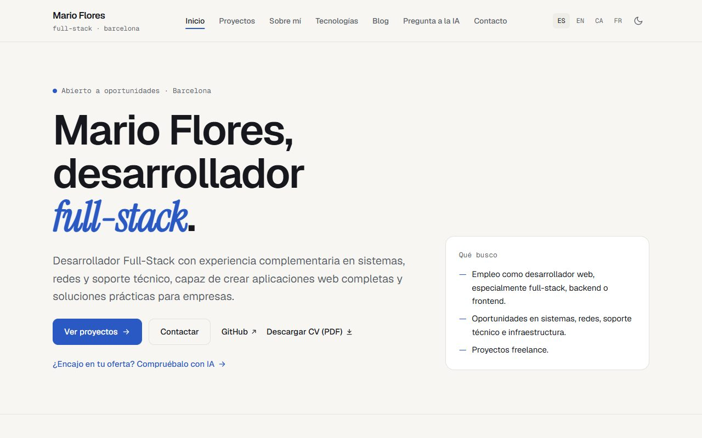
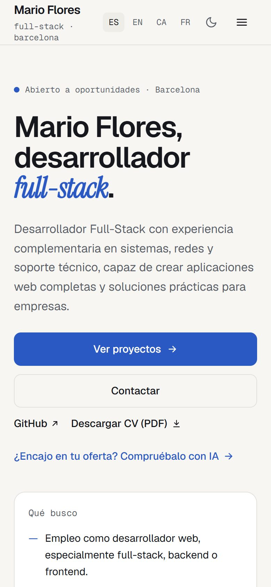
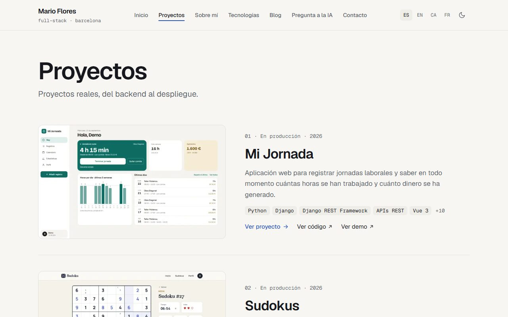
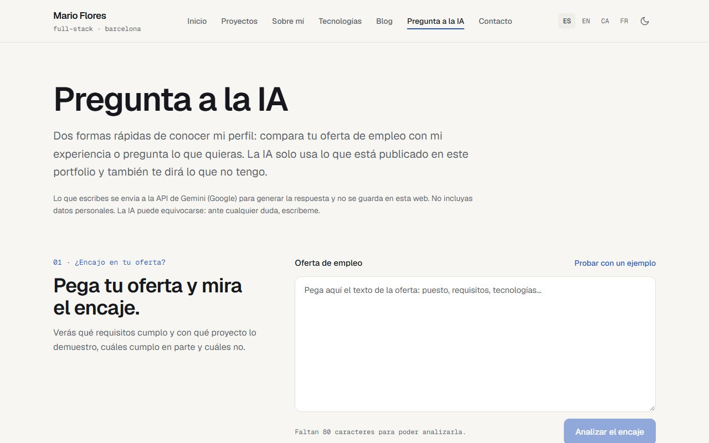

# Portfolio · Mario Flores

Portfolio profesional de Mario Flores, desarrollador full-stack en Barcelona.

**Web publicada:** https://mfloresr-portfolio.vercel.app · en castellano, inglés, catalán y francés.

## Capturas

<p align="center">
  
  
</p>
<p align="center">
  
  
</p>

## Tecnología

- [Next.js 16](https://nextjs.org) (App Router) y TypeScript.
- Páginas estáticas generadas al compilar, sin base de datos.
- [next-intl](https://next-intl.dev): rutas con prefijo de idioma (`/es`, `/en`).
  El idioma se lee con `next/root-params`, y `proxy.ts` (el antiguo *middleware*) redirige `/` según el navegador.
- Tailwind CSS 4, con modo claro y oscuro sin dependencias extra.
- Página «Pregunta a la IA» (`/ask`): compara una oferta de empleo con el perfil o responde preguntas,
  usando la API de Gemini y solo el contenido publicado en el portfolio.
- Vercel para el despliegue.

## Estructura

```text
app/
  [locale]/            páginas por idioma: inicio, projects, about, technologies, blog, ask, contact
    projects/[slug]/   fichas de proyecto (mi-jornada, sudokus, agroclima-consultores)
    blog/[slug]/       artículos
    blog/tag/[tag]/    artículos por etiqueta
    [...rest]/         cualquier otra ruta → 404 traducido
  api/ia/              rutas de la IA (encaje con una oferta y preguntas)
  sitemap.ts, robots.ts
components/layout/     cabecera, navegación, menú móvil, selector de idioma, tema y pie
i18n/                  idiomas (routing.ts), navegación y configuración por petición
messages/              textos de la interfaz: es.json, en.json
lib/sitio.ts           URL base, secciones y hreflang
lib/contenido/         lectura y validación del contenido (esquemas zod, MDX)
lib/ia/                cliente de Gemini y preparación del contexto de la IA
content/               perfil, catálogo de tecnologías y proyectos (ver abajo)
scripts/               comprobar-contenido.ts
proxy.ts               redirección por idioma
```

## Idiomas

- **Publicados:** castellano (`es`), inglés (`en`), catalán (`ca`) y francés (`fr`).
- Para añadir uno basta con incluirlo en `i18n/routing.ts`, crear `messages/<idioma>.json` y traducir
  el contenido. Las rutas no cambian: son las mismas en todos los idiomas (`/es/projects`,
  `/en/projects`...).

## Contenido

Todo el contenido está en `content/` y se valida al compilar: si un archivo no cumple su
esquema (`lib/contenido/esquemas.ts`), **el build falla** indicando el archivo y el campo.

```text
content/
  perfil.yaml                    identidad, contacto, formación, qué busca, perfil complementario
  tecnologias.yaml               catálogo (destacada: true = declarada por Mario)
  proyectos/<slug>/
    proyecto.yaml                datos comunes: estado, año, tecnologías (ids del catálogo), repositorio, demo, capturas
    es.mdx, en.mdx...            textos por idioma (frontmatter) y cuerpo MDX opcional
  blog/<slug>/
    es.mdx, en.mdx...            artículo por idioma: frontmatter (título, resumen, fecha, categoría,
                                 etiquetas, destacado, proyectos relacionados) y cuerpo MDX
```

- **Nada se inventa.** Un campo con `null` se muestra como **Pendiente** (`components/Pendiente.tsx`).
- `revisado: false` en una ficha muestra el aviso "borrador pendiente de revisión".
- Si falta el `.mdx` de un idioma, la ficha muestra "traducción pendiente" y enlaza a la versión en castellano.
- En YAML, un texto que contenga `: ` va entre comillas.
- **Blog:** categorías fijas (`proyectos`, `desarrollo`, `sistemas`, `despliegue`, `ia`) y etiquetas libres.
  Los proyectos citados en `proyectos:` deben existir o el build falla. Un artículo escrito en un solo
  idioma aparece en ambos con el aviso "Solo en castellano" y enlace a la versión original (sin indexar).
  `borrador: true` solo se ve en local y en vistas previas; nunca en producción. El código se resalta
  al compilar (Shiki, tema claro y oscuro), sin JavaScript en el navegador.

```bash
npm run contenido                 # valida y lista todo lo pendiente
npm run contenido -- --estricto   # falla si queda algo pendiente (usar antes de publicar)
```

## Desarrollo

```bash
npm install
npm run dev        # http://localhost:3000
npm run lint
npx tsc --noEmit
npm run build
npm run contenido
```

## Variables de entorno

En `.env.example` tienes un ejemplo con todas (sin valores reales).

| Variable | Descripción |
|---|---|
| `OCULTAR_BORRADORES` | Con `1`, oculta los borradores del blog también fuera de producción (para probar). |
| `GEMINI_API_KEY` | Clave de la API de Gemini (Google AI Studio) para «Pregunta a la IA». Sin ella, esa función no está disponible. Va en las variables de Vercel, nunca en el código. |
| `SITE_URL` | URL pública, para las URL canónicas, el sitemap y los hreflang. Por defecto `https://mfloresr-portfolio.vercel.app`. Cambiarla es lo único necesario para pasar a un dominio propio. |

## Despliegue

Vercel (proyecto `mfloresr-portfolio`) publica `main` en producción y cada rama en una vista previa.
Las vistas previas no se dejan indexar (`robots.txt`).
